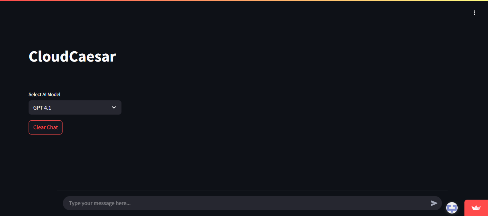

# CloudCaesar

An AI chatbot built with Streamlit. Supports multiple AI models (e.g., Llama, GPT) and a beautiful, responsive UI. 

**This Chatbot is deployed at Streamlit Cloud:** https://cloudcaesar.streamlit.app

**Note:** This version is text-only and can be deployed on [Streamlit Community Cloud](https://streamlit.io/cloud).

---



---

## Features
- Chat with various AI models (selectable in the sidebar)
- Clean, modern UI with markdown/code formatting
- Persistent conversation history (per session)
- Easy to deploy on Streamlit Cloud

---

## Setup

### 1. Clone the Repository
```bash
git clone https://github.com/your-username/your-repo-name.git
cd your-repo-name
```

### 2. Install Dependencies
```bash
pip install -r requirements.txt
```

### 3. Add Your AI Model Keys (if needed)
- If your models require API keys (e.g., OpenAI), create a `.env` file or set environment variables as needed.

### 4. Run Locally
```bash
streamlit run app.py
```

---

## Deploy on Streamlit Cloud
1. Push your code to GitHub.
2. Go to [Streamlit Cloud](https://streamlit.io/cloud) and connect your repo.
3. Set any required secrets (API keys, etc.) in the Streamlit Cloud UI.
4. Click **Deploy**.

---

## File Structure
```
├── app.py                # Main Streamlit app
├── requirements.txt      # Python dependencies
├── utils/
│   └── ai_models.py      # Model selection and response logic
├── .gitignore
└── README.md
```

---

## Customization
- To add or change models, edit `utils/ai_models.py` and `models.csv` (if used).
- To change UI, edit `app.py` (Streamlit widgets and CSS).

---

## License
MIT License

---

## Credits
- Website built with [Streamlit](https://streamlit.io/)
- APIs supplied by [OpenRouter](https://openrouter.ai)
- AI model integration by [Utkarsh Gyan](https://github.com/UTGyan7)

---

⚡ Built by [Utkarsh Gyan](https://github.com/UTGyan7) — I build fast & freelance small gigs too. DM me!
